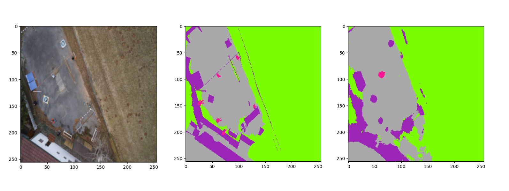

### [Dataset](https://www.kaggle.com/datasets/bulentsiyah/semantic-drone-dataset)

Custom small UNet approach with class balanced loss function

### Results
RGB | Ground Truth Prediction




**Epochs**: 46

**Training Loss**: 0.31157248963912326 

**Epoch accuracy**:  0.897006098429362 

**Epoch class accuracy**: 
- obstacles: 0.4516, 
- water: 0.2212
- nature: 0.7737
- moving: 0.3971 
- landable: 0.8190


Torchsummary:
```
----------------------------------------------------------------
Layer (type)
Output Shape
Param #
================================================================
Conv2d-1
[-1, 16, 256, 256]11
448
BatchNorm2d-2
[-1, 16, 256, 256]
32
ReLU-3
[-1, 16, 256, 256]
0
Conv2d-4
[-1, 32, 128, 128]
4,640
BatchNorm2d-5
[-1, 32, 128, 128]
64
ReLU-6
[-1, 32, 128, 128]
0
Conv2d-7
[-1, 64, 64, 64]
18,496
BatchNorm2d-8
[-1, 64, 64, 64]
128
ReLU-9
[-1, 64, 64, 64]
0Conv2d-10
[-1, 128, 32, 32]
73,856
BatchNorm2d-11
[-1, 128, 32, 32]
256
ReLU-12
[-1, 128, 32, 32]
0
Conv2d-13
[-1, 256, 16, 16]
295,168
BatchNorm2d-14
[-1, 256, 16, 16]
512
ReLU-15
[-1, 256, 16, 16]
0
ConvTranspose2d-16
[-1, 128, 32, 32]
131,200
BatchNorm2d-17
[-1, 128, 32, 32]
256
ReLU-18
[-1, 128, 32, 32]
0
Conv2d-19
[-1, 128, 32, 32]
295,040
BatchNorm2d-20
[-1, 128, 32, 32]
256
ReLU-21
[-1, 128, 32, 32]
0
ConvTranspose2d-22
[-1, 64, 64, 64]
32,832
BatchNorm2d-23
[-1, 64, 64, 64]
128
ReLU-24
[-1, 64, 64, 64]
0
Conv2d-25
[-1, 64, 64, 64]
73,792
BatchNorm2d-26
[-1, 64, 64, 64]
128
ReLU-27
[-1, 64, 64, 64]
0
ConvTranspose2d-28
[-1, 32, 128, 128]
8,224
BatchNorm2d-29
[-1, 32, 128, 128]
64
ReLU-30
[-1, 32, 128, 128]
0
Conv2d-31
[-1, 32, 128, 128]
18,464
BatchNorm2d-32
[-1, 32, 128, 128]
64
ReLU-33
[-1, 32, 128, 128]
0
ConvTranspose2d-34
[-1, 16, 256, 256]
2,064
BatchNorm2d-35
[-1, 16, 256, 256]
32
ReLU-36
[-1, 16, 256, 256]
0
Conv2d-37
[-1, 16, 256, 256]
4,624
BatchNorm2d-38
[-1, 16, 256, 256]
32
ReLU-39
[-1, 16, 256, 256]
0
Conv2d-40
[-1, 5, 256, 256]
85
================================================================
Total params: 960,885
Trainable params: 960,885
Non-trainable params: 0
----------------------------------------------------------------
Input size (MB): 0.75
Forward/backward pass size (MB): 139.00
Params size (MB): 3.67
Estimated Total Size (MB): 143.42
---------------------------------------------------------------
```